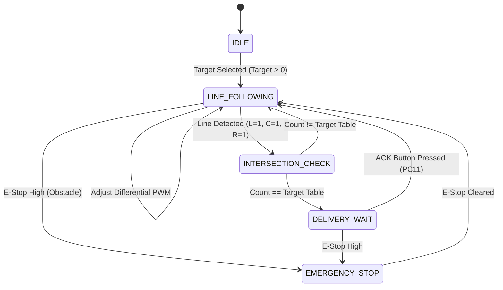

The logic in the main.c file explained with an FSM diagram:

```mermaid
stateDiagram-v2
    [*] --> IDLE
    
    IDLE --> LINE_FOLLOWING : Target Selected (Target > 0)
    
    LINE_FOLLOWING --> EMERGENCY_STOP : E-Stop High (Obstacle)
    LINE_FOLLOWING --> INTERSECTION_CHECK : Line Detected (L=1, C=1, R=1)
    LINE_FOLLOWING --> LINE_FOLLOWING : Adjust Differential PWM
    
    EMERGENCY_STOP --> LINE_FOLLOWING : E-Stop Cleared
    
    INTERSECTION_CHECK --> DELIVERY_WAIT : Count == Target Table
    INTERSECTION_CHECK --> LINE_FOLLOWING : Count != Target Table
    
    DELIVERY_WAIT --> LINE_FOLLOWING : ACK Button Pressed (PC11)
    DELIVERY_WAIT --> EMERGENCY_STOP : E-Stop High
```
