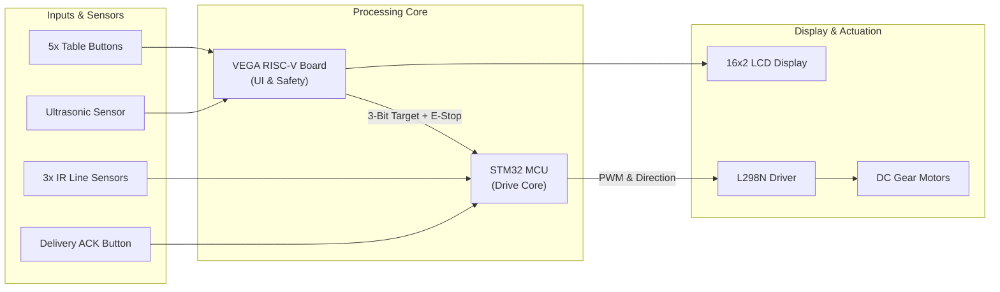

```mermaid
flowchart LR
    subgraph User_And_Sensors ["Inputs & Sensors"]
        B["5x Table Buttons"]
        US["Ultrasonic Sensor"]
        IR["3x IR Line Sensors"]
        ACK["Delivery ACK Button"]
    end

    subgraph Processing_Units ["Processing Core"]
        VEGA["VEGA RISC-V Board<br/>(UI & Safety)"]
        STM["STM32 MCU<br/>(Drive Core)"]
    end

    subgraph Output_Actuation ["Display & Actuation"]
        LCD["16x2 LCD Display"]
        L298N["L298N Driver"]
        MOTORS["DC Gear Motors"]
    end

    B --> VEGA
    US --> VEGA
    VEGA --> LCD

    VEGA -->|3-Bit Target + E-Stop| STM
    IR --> STM
    ACK --> STM

    STM -->|PWM & Direction| L298N
    L298N --> MOTORS
```
